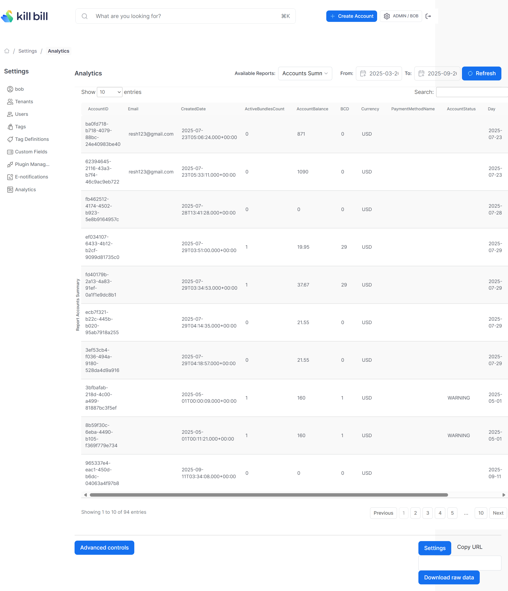

# Accounts Summary Report

Provides an account summary. Provides details like account balance, account status, currency, etc.

The snapshot view is: `v_report_accounts_summary`

## Report Creation

```
curl -v \
     -X POST \
     -u admin:password \
     -H "X-Killbill-ApiKey:bob" \
     -H "X-Killbill-ApiSecret:lazar" \
     -H 'Content-Type: application/json' \
     -d '{"reportName": "report_accounts_summary",
          "reportType": "TABLE",
          "reportPrettyName": "Accounts Summary",
          "sourceTableName": "report_accounts_summary",
          "refreshProcedureName": "refresh_report_accounts_summary",
          "refreshFrequency": "HOURLY"}' \
     "http://127.0.0.1:8080/plugins/killbill-analytics/reports"
```

## Report UI:




