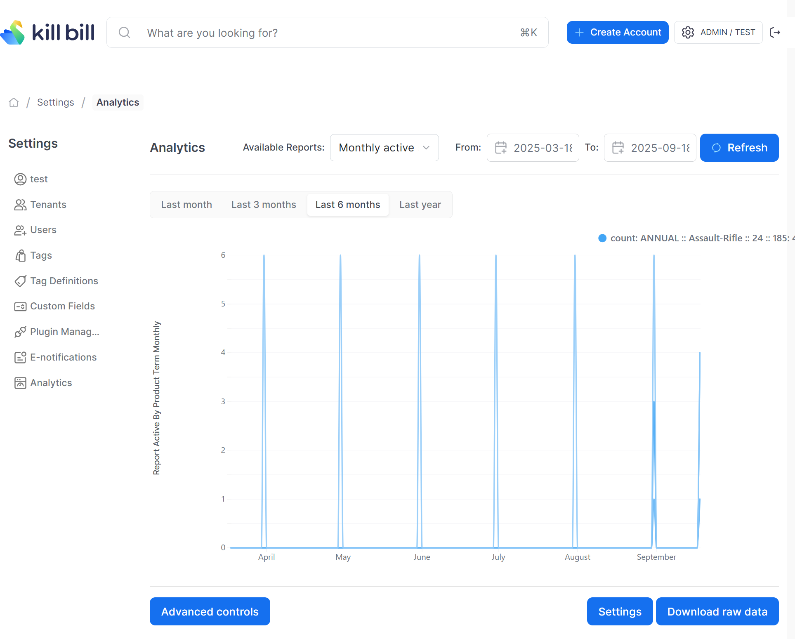

# Monthly Active Subscriptions Report

Compute (at the end of each month) the total number of active subscriptions per product and billing period.

The snapshot view is: `v_report_active_by_product_term_monthly`

## Report Creation

```
curl -v \
     -X POST \
     -u admin:password \
     -H "X-Killbill-ApiKey:bob" \
     -H "X-Killbill-ApiSecret:lazar" \
     -H 'Content-Type: application/json' \
     -d '{"reportName": "report_active_by_product_term_monthly",
          "reportType": "TIMELINE",
          "reportPrettyName": "Monthly Active Subscriptions by Product Term",
          "sourceTableName": "report_active_by_product_term_monthly",
          "refreshProcedureName": "refresh_active_by_product_term_monthly",
          "refreshFrequency": "HOURLY"}' \
     "http://127.0.0.1:8080/plugins/killbill-analytics/reports"
```
## Sample Data

| tenant_record_id | day        | product_name | billing_period | count |
|------------------|------------|--------------|----------------|-------|
| 1                | 2025-08-31 | Gold         | MONTHLY        | 3     |
| 2                | 2025-08-31 | Gold         | MONTHLY        | 1     |
| 1                | 2025-08-31 | Gold         | ANNUAL         | 2     |
| 2                | 2025-09-30 | Silver       | MONTHLY        | 4     |
| 2                | 2025-09-30 | Gold         | QUARTERLY      | 1     |

The first row in the above table indicates that on `2025-08-31` the `tenant_record_id=1` had 3 Monthly subscriptions for the `Gold` product.


## Report UI:

