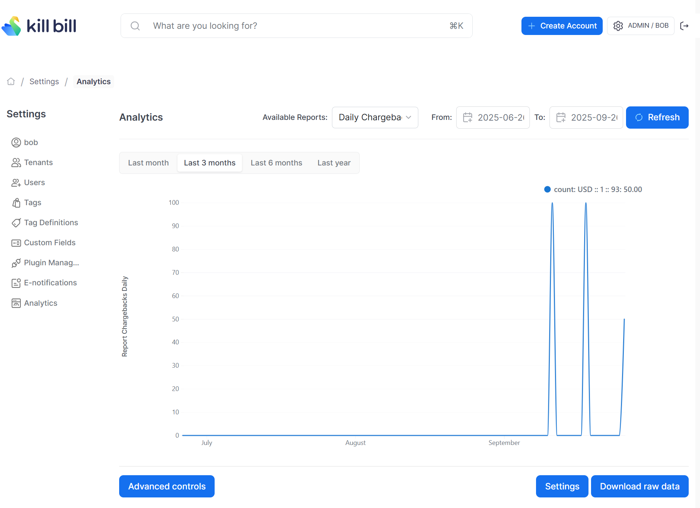

# Daily Chargebacks Report

Compute the total value (in the reference currency) of chargebacks per day per currency.

The snapshot view is: `v_report_chargebacks_daily`

## Report Creation

```
curl -v \
     -X POST \
     -u admin:password \
     -H "X-Killbill-ApiKey:bob" \
     -H "X-Killbill-ApiSecret:lazar" \
     -H 'Content-Type: application/json' \
     -d '{"reportName": "report_chargebacks_daily",
          "reportType": "TIMELINE",
          "reportPrettyName": "Daily Chargebacks Value",
          "sourceTableName": "report_chargebacks_daily",
          "refreshProcedureName": "refresh_report_chargebacks_daily",
          "refreshFrequency": "HOURLY"}' \
     "http://127.0.0.1:8080/plugins/killbill-analytics/reports"
```

## Sample Data

| tenant_record_id | day        | currency | count    |
|------------------|------------|----------|----------|
| 1                | 2025-09-18 | USD      | 100.0000 |
| 1                | 2025-09-26 | USD      | 50.0000  |
| 2                | 2025-09-11 | USD      | 100.0000 |

The first row in the above table indicates that on `2025-09-18`, the `tenant_record_id=1` had a total chargeback value of `$100`


## Report UI:




