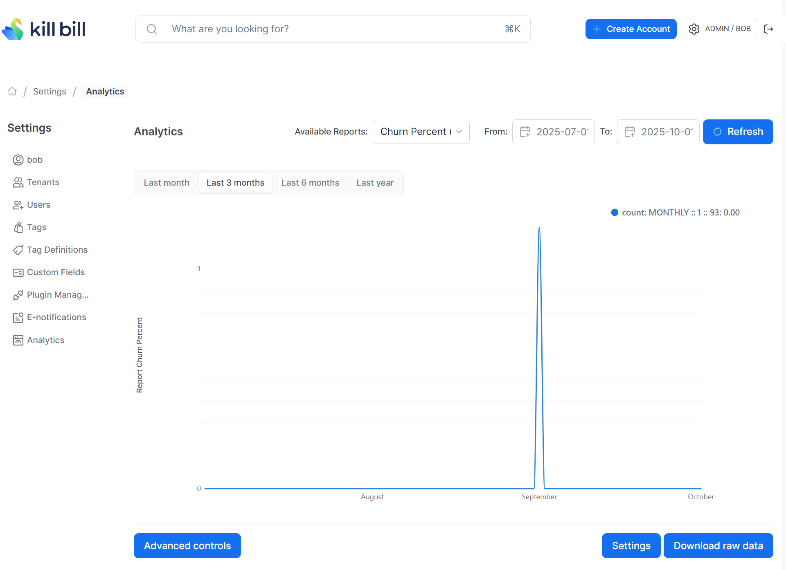
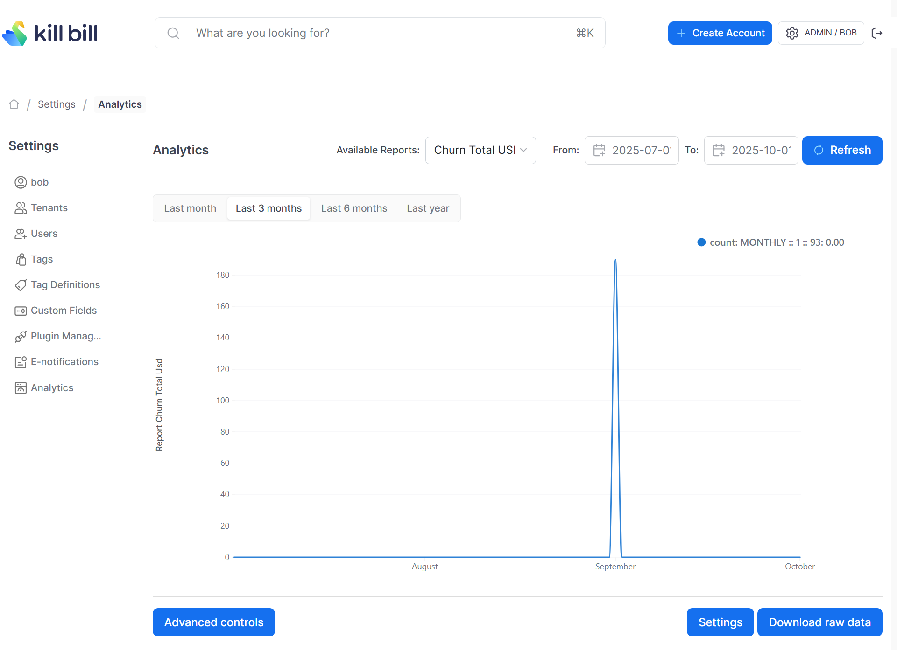

# Churn (Monthly and Annual) Report

This report tracks customer churn in dollar terms, showing both the total churned revenue and the churn percentage for monthly and annual subscriptions on a per-tenant, per-month basis.

The snapshot view is: `v_report_churn_percent_and_total_usd`

## Database Indices

The churn reports requires some additional database indices to be created. See [churn-indices.ddl](churn-indices.ddl)

## Churn Percent Configuration

```
curl -v \
     -X POST \
     -u admin:password \
     -H "X-Killbill-ApiKey:bob" \
     -H "X-Killbill-ApiSecret:lazar" \
     -H 'Content-Type: application/json' \
     -d '{"reportName": "report_churn_percent",
          "reportType": "TIMELINE",
          "reportPrettyName": "Churn Percent (Monthly and Annual)",
          "sourceTableName": "report_churn_percent",
          "refreshProcedureName": "refresh_report_churn_percent",
          "refreshFrequency": "HOURLY"}' \
     "http://127.0.0.1:8080/plugins/killbill-analytics/reports"
```

## Churn Percentage Report UI



## Churn Amount Configuration

```
curl -v \
     -X POST \
     -u admin:password \
     -H "X-Killbill-ApiKey:bob" \
     -H "X-Killbill-ApiSecret:lazar" \
     -H 'Content-Type: application/json' \
     -d '{"reportName": "report_churn_total_usd",
          "reportType": "TIMELINE",
          "reportPrettyName": "Churn Total USD (Monthly and Annual)",
          "sourceTableName": "report_churn_total_usd",
          "refreshProcedureName": "refresh_report_churn_total_usd",
          "refreshFrequency": "DAILY"}' \
     "http://127.0.0.1:8080/plugins/killbill-analytics/reports"
```

## Churn Amount Report UI


