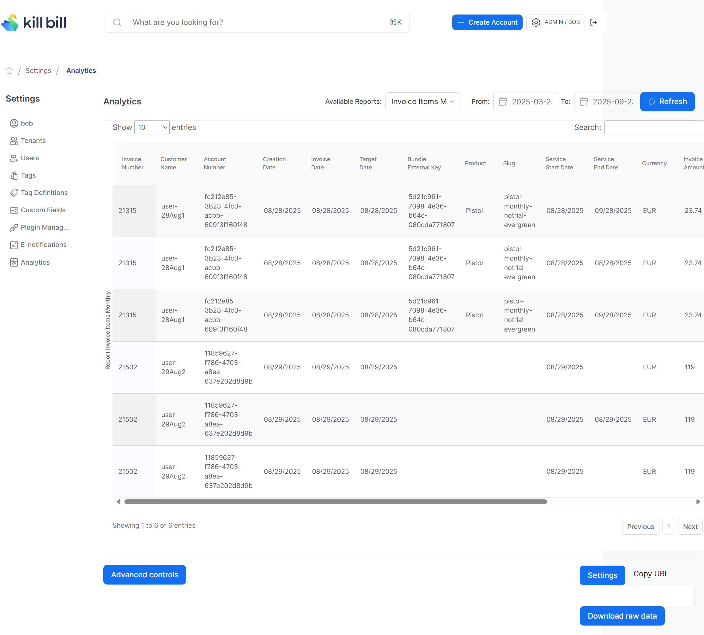

# Invoice Items Monthly Report

Report of all invoice items from the previous month, showing amounts in both original currency and USD equivalents.

The snapshot view is: `v_report_invoice_items_monthly`

## Prerequisites

This report requires the `analytics_currency_conversion` table to be populated. See [insertMonthlyCurrencyConversionRates.ddl](../utils/insertMonthlyCurrencyConversionRates.ddl)

## Report Creation

```
curl -v \
     -X POST \
     -u admin:password \
     -H "X-Killbill-ApiKey:bob" \
     -H "X-Killbill-ApiSecret:lazar" \
     -H 'Content-Type: application/json' \
     -d '{"reportName": "report_invoice_items_monthly",
          "reportType": "TABLE",
          "reportPrettyName": "Invoice Items Monthly Report",
          "sourceTableName": "report_invoice_items_monthly",
          "refreshProcedureName": "refresh_report_invoice_items_monthly",
          "refreshFrequency": "HOURLY"}' \
     "http://127.0.0.1:8080/plugins/killbill-analytics/reports"
```

## Report UI:


