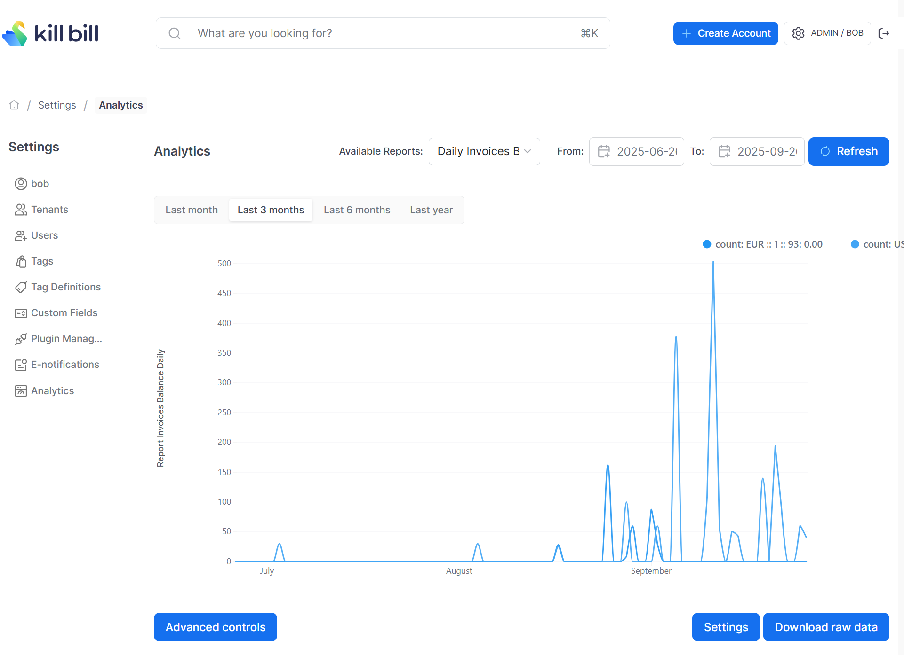

# Daily Invoice Balance Report

Compute the total sum of invoices balance (in the reference currency) per invoice created day.

The snapshot view is: `v_report_invoices_balance_daily`

## Report Creation

```
curl -v \
     -X POST \
     -u admin:password \
     -H "X-Killbill-ApiKey:bob" \
     -H "X-Killbill-ApiSecret:lazar" \
     -H 'Content-Type: application/json' \
     -d '{"reportName": "report_invoices_balance_daily",
          "reportType": "TIMELINE",
          "reportPrettyName": "Daily Invoices Balance",
          "sourceTableName": "report_invoices_balance_daily",
          "refreshProcedureName": "refresh_report_invoices_balance_daily",
          "refreshFrequency": "HOURLY"}' \
     "http://127.0.0.1:8080/plugins/killbill-analytics/reports"
```

## Sample Data

| tenant_record_id | currency | day        | count   |
|------------------|----------|------------|---------|
| 1                | EUR      | 2025-09-15 | 15.0000 |
| 1                | EUR      | 2025-09-01 | 0.0000  |
| 1                | USD      | 2025-09-15 | 42.9000 |
| 2                | USD      | 2025-09-02 | 59.5000 |
| 2                | EUR      | 2025-09-16 | 0.0000  |


The first row in the above table indicates that on the date `2025-09-15`, the tenant with record id=1 had a total invoice balance of EUR 15.

## Report UI:

