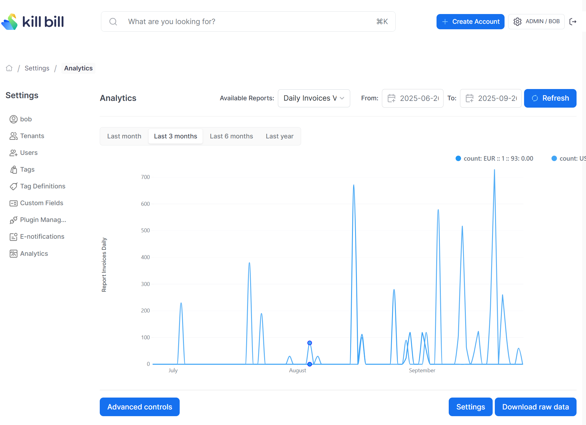

# Daily Invoices Report

Compute the total invoice amount charged (in the reference currency) per day per currency.

The snapshot view is: `v_report_invoices_daily`

## Report Creation

```
curl -v \
     -X POST \
     -u admin:password \
     -H "X-Killbill-ApiKey:bob" \
     -H "X-Killbill-ApiSecret:lazar" \
     -H 'Content-Type: application/json' \
     -d '{"reportName": "report_invoices_daily",
          "reportType": "TIMELINE",
          "reportPrettyName": "Daily Invoices Value",
          "sourceTableName": "report_invoices_daily",
          "refreshProcedureName": "refresh_report_invoices_daily",
          "refreshFrequency": "DAILY"}' \
     "http://127.0.0.1:8080/plugins/killbill-analytics/reports"
```

## Report UI:

