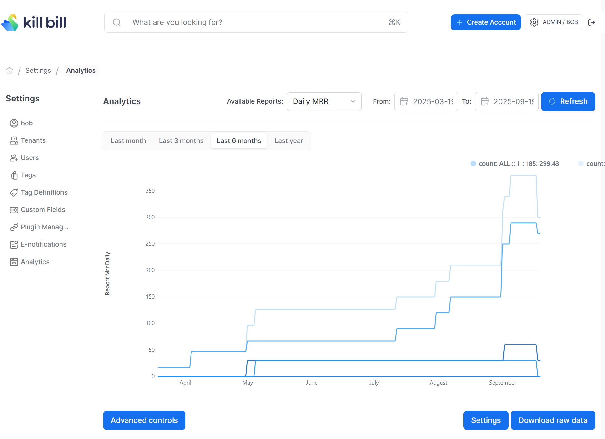

# Daily MRR

Computes the total active MRR (monthly recurring revenue), broken down both by product and as a tenant-wide total (ALL) for each tenant and each day.

The snapshot view is: `v_report_mrr_daily`

## Report Creation

```
curl -v \
     -X POST \
     -u admin:password \
     -H "X-Killbill-ApiKey:bob" \
     -H "X-Killbill-ApiSecret:lazar" \
     -H 'Content-Type: application/json' \
     -d '{"reportName": "report_mrr_daily",
          "reportType": "TIMELINE",
          "reportPrettyName": "Daily MRR",
          "sourceTableName": "report_mrr_daily",
          "refreshProcedureName": "refresh_report_mrr_daily",
          "refreshFrequency": "HOURLY"}' \
     "http://127.0.0.1:8080/plugins/killbill-analytics/reports"
```

## Sample Data

| tenant_record_id | currency | product       | day        | count    |
|------------------|----------|---------------|------------|----------|
| 1                | USD      | Pistol        | 2025-08-07 | 224.6292 |
| 1                | USD      | Blowdart      | 2025-08-07 | 29.9500  |
| 1                | EUR      | Knife         | 2025-08-07 | 29.9500  |
| 1                | USD      | Assault-Rifle | 2025-08-07 | 499.9958 |
| 2                | USD      | Pistol        | 2025-08-07 | 100.0000 |
| 2                | USD      | All           | 2025-08-07 | 100.0000 |


The first row in the above table indicates that on the date `2025-08-07`, the MRR for the `Pistol` product was $150 for `tenant_record_id=1`.

## Report UI:

