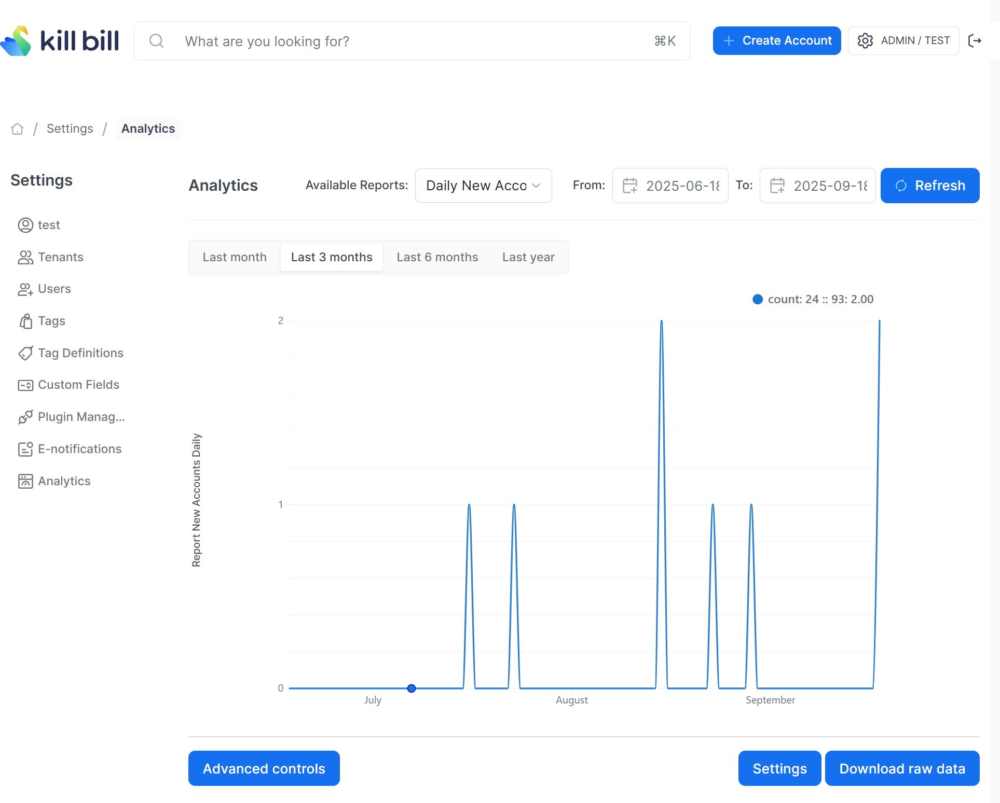

# Daily New Accounts Report

Compute the total amount of new accounts created per day for each tenant.

The snapshot view is: `v_report_new_accounts_daily`

## Report Creation

```
curl -v \
     -X POST \
     -u admin:password \
     -H "X-Killbill-ApiKey:bob" \
     -H "X-Killbill-ApiSecret:lazar" \
     -H 'Content-Type: application/json' \
     -d '{"reportName": "report_new_accounts_daily",
          "reportType": "TIMELINE",
          "reportPrettyName": "Daily New Accounts",
          "sourceTableName": "report_new_accounts_daily",
          "refreshProcedureName": "refresh_report_new_accounts_daily",
          "refreshFrequency": "HOURLY"}' \
     "http://127.0.0.1:8080/plugins/killbill-analytics/reports"
```

## Sample Data

| ID | Date       | Value |
|----|------------|-------|
| 1  | 2025-09-18 | 4     |
| 1  | 2025-09-19 | 4     |
| 2  | 2025-09-19 | 4     |
| 1  | 2025-09-21 | 1     |
| 2  | 2025-09-21 | 1     |
| 1  | 2025-09-22 | 1     |


The first row in the above table indicates that on the date `2025-09-18`, the tenant with record id=1 had 4 new accounts created.


## Report UI:


