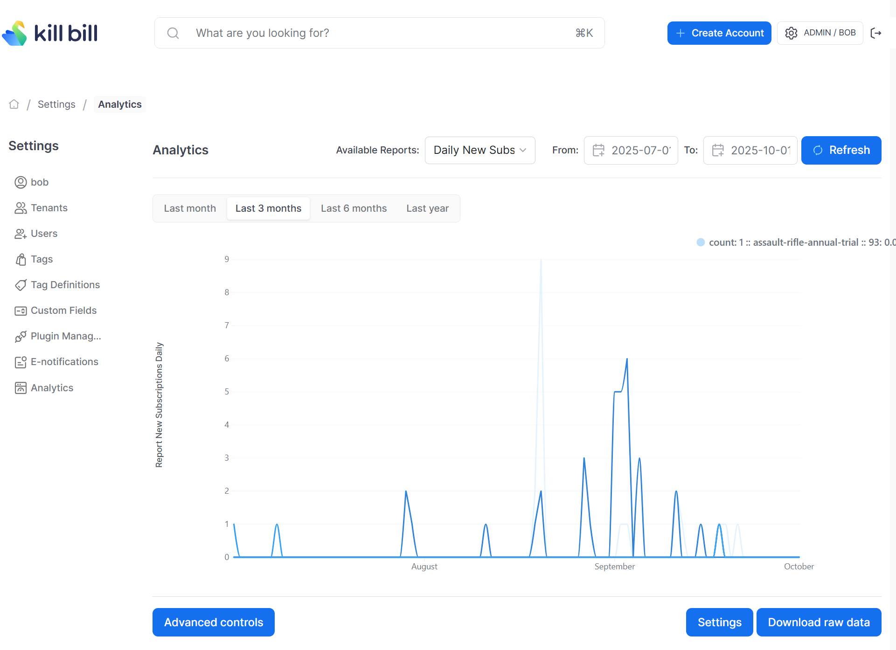

# Daily New Subscriptions Report

Compute the total amount of new subscriptions created per day for each tenant.

The snapshot view is: `v_report_new_subscriptions_daily`

## Report Creation

```
curl -v \
     -X POST \
     -u admin:password \
     -H "X-Killbill-ApiKey:bob" \
     -H "X-Killbill-ApiSecret:lazar" \
     -H 'Content-Type: application/json' \
     -d '{"reportName": "report_new_subscriptions_daily",
          "reportType": "TIMELINE",
          "reportPrettyName": "Daily New Subscriptions",
          "sourceTableName": "report_new_subscriptions_daily",
          "refreshProcedureName": "refresh_report_new_subscriptions_daily",
          "refreshFrequency": "HOURLY"}' \
     "http://127.0.0.1:8080/plugins/killbill-analytics/reports"
```


## Sample Data

| Tenant Record Id | Slug                               | Day        | Count |
|------------------|------------------------------------|------------|-------|
| 1                | blowdart-monthly-notrial-evergreen | 2025-08-20 | 9     |
| 1                | pistol-monthly-notrial-evergreen   | 2025-08-20 | 2     |
| 1                | pistol-monthly-notrial-evergreen   | 2025-09-01 | 5     |
| 1                | blowdart-monthly-notrial-evergreen | 2025-09-02 | 6     |
| 25               | gold-monthly-notrial-evergreen     | 2025-09-02 | 5     |
| 25               | silver-monthly-notrial-evergreen   | 2025-09-03 | 6     |


The first row in the above table indicates that on the date `2025-08-20`, the tenant with record id=1 had 9 new subscriptions created.


## Report UI:



