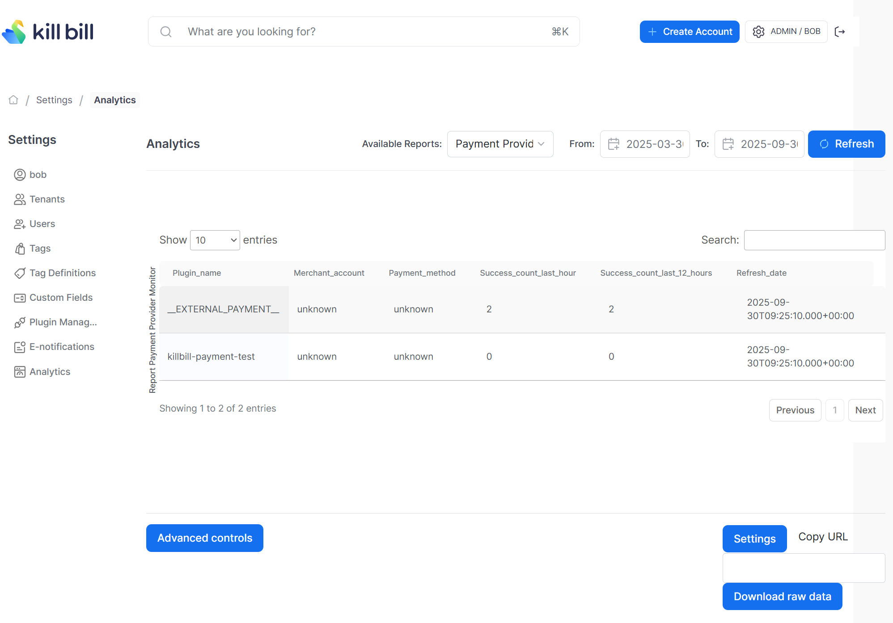

# Payment Provider Monitor report

Compute the number of successful transactions that have occurred in the past hour, for each payment service provider that has had transactions within the last week.

The snapshot view is: `v_report_payment_provider_monitor`

## Report Creation

```
curl -v \
     -X POST \
     -u admin:password \
     -H "X-Killbill-ApiKey:bob" \
     -H "X-Killbill-ApiSecret:lazar" \
     -H 'Content-Type: application/json' \
     -d '{"reportName": "report_payment_provider_monitor",
          "reportType": "TABLE",
          "reportPrettyName": "Payment Provider Monitor",
          "sourceTableName": "report_payment_provider_monitor",
          "refreshProcedureName": "refresh_report_payment_provider_monitor",
          "refreshFrequency": "HOURLY"}' \
     "http://127.0.0.1:8080/plugins/killbill-analytics/reports"
```

## Report UI:

