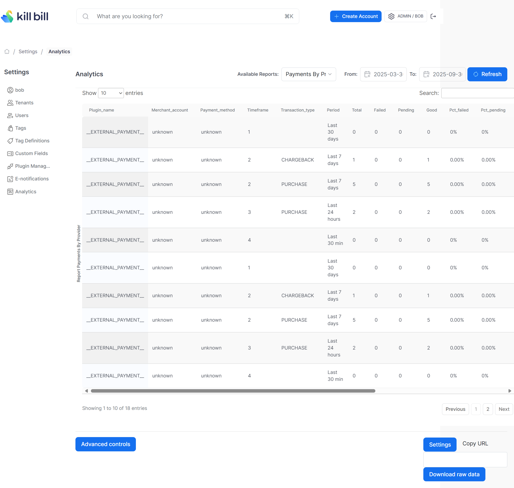
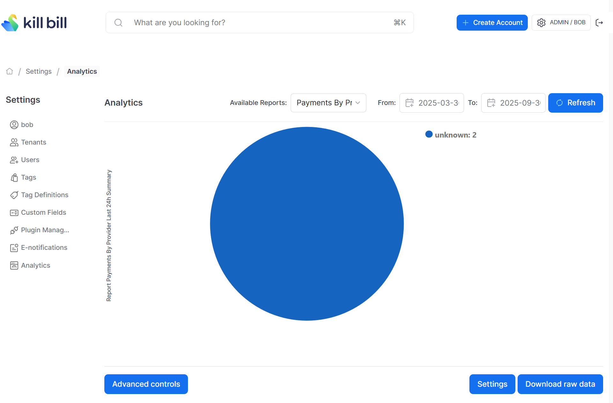

# Payments By Provider report

Compute the number of payments by transaction state over different timeframes for each payment service provider (plugin).

The snapshot view is: `v_report_payments_by_provider`

## Report Creation (Payment by Provider)

```
curl -v \
     -X POST \
     -u admin:password \
     -H "X-Killbill-ApiKey:bob" \
     -H "X-Killbill-ApiSecret:lazar" \
     -H 'Content-Type: application/json' \
     -d '{"reportName": "report_payments_by_provider",
          "reportType": "TABLE",
          "reportPrettyName": "Payments By Provider",
          "sourceTableName": "report_payments_by_provider",
          "refreshProcedureName": "refresh_report_payments_by_provider",
          "refreshFrequency": "HOURLY"}' \
     "http://127.0.0.1:8080/plugins/killbill-analytics/reports"
```

## Payment by Provider Report UI



## Report Creation (Payment by Provider - Last 24 Hours Summary)

```
curl -v \
     -X POST \
     -u admin:password \
     -H "X-Killbill-ApiKey:bob" \
     -H "X-Killbill-ApiSecret:lazar" \
     -H 'Content-Type: application/json' \
     -d '{"reportName": "report_payments_by_provider_last_24h_summary",
          "reportType": "COUNTERS",
          "reportPrettyName": "Payments By Provider Summary (last 24hrs)",
          "sourceTableName": "report_payments_by_provider_last_24h_summary",
          "refreshProcedureName": "refresh_report_payments_by_provider_last_24h_summary",
          "refreshFrequency": "HOURLY"}' \
     "http://127.0.0.1:8080/plugins/killbill-analytics/reports"
```

## Payment by Provider - Last 24 Hours Summary UI

