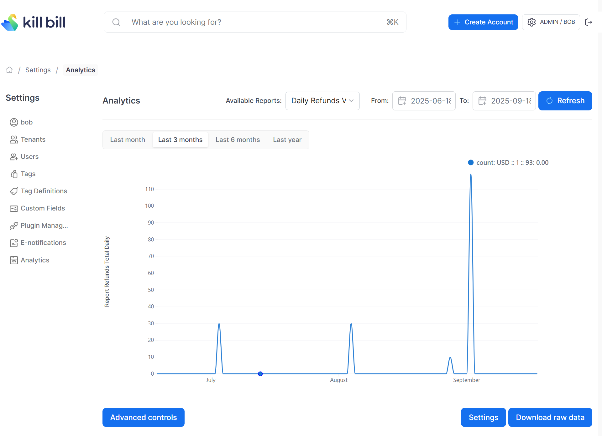

# Daily Refunds Report

Compute the total value (in the reference currency) of refunds per day per currency for each tenant.

The snapshot view is: `v_report_refunds_total_daily`

## Report Creation

```
curl -v \
     -X POST \
     -u admin:password \
     -H "X-Killbill-ApiKey:bob" \
     -H "X-Killbill-ApiSecret:lazar" \
     -H 'Content-Type: application/json' \
     -d '{"reportName": "report_refunds_total_daily",
          "reportType": "TIMELINE",
          "reportPrettyName": "Daily Refunds Value",
          "sourceTableName": "report_refunds_total_daily",
          "refreshProcedureName": "refresh_report_refunds_total_daily",
          "refreshFrequency": "HOURLY"}' \
     "http://127.0.0.1:8080/plugins/killbill-analytics/reports"
```

## Report UI:


