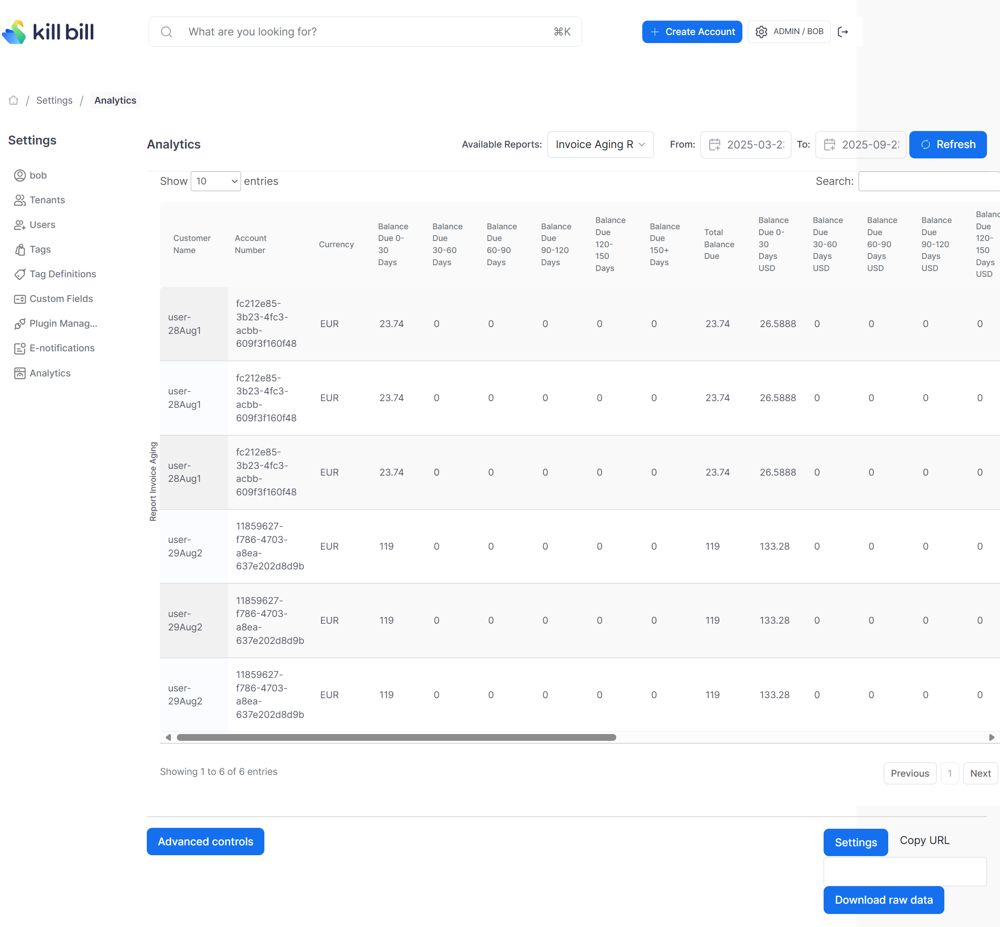

# Invoice Aging Report

This report lists all customer invoice aging with remaining balances, breaking them into standard aging buckets and converting amounts to USD for easy comparison.

The snapshot view is: `v_report_invoice_aging`

## Prerequisites

This report requires the `analytics_currency_conversion` table to be populated. See [insertMonthlyCurrencyConversionRates.ddl](../utils/insertMonthlyCurrencyConversionRates.ddl)

## Report Creation

```
curl -v \
     -X POST \
     -u admin:password \
     -H "X-Killbill-ApiKey:bob" \
     -H "X-Killbill-ApiSecret:lazar" \
     -H 'Content-Type: application/json' \
     -d '{"reportName": "report_invoice_aging",
          "reportType": "TABLE",
          "reportPrettyName": "Invoice Aging Report",
          "sourceTableName": "report_invoice_aging",
          "refreshProcedureName": "refresh_report_invoice_aging",
          "refreshFrequency": "DAILY"}' \
     "http://127.0.0.1:8080/plugins/killbill-analytics/reports"
```

## Report UI:


