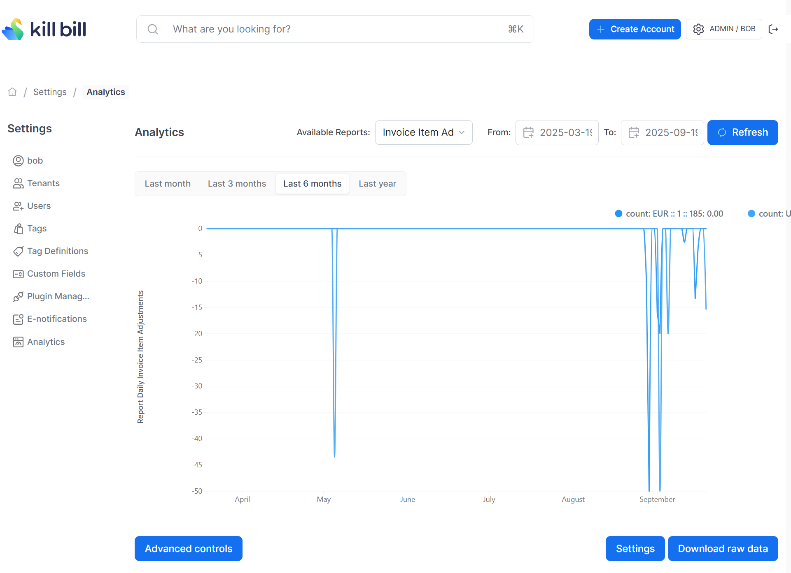

# Daily Invoice Item Adjustments report

Total of  invoice item adjustments per tenant, per currency and per day.

So if there is an invoice for `$100` created on `2025-09-21` and the invoice is adjusted for `$20`, this report will show a value of `-20` for the date `2025-09-21` for the particular tenant. If there are multiple invoice item adjustments for the tenant on the same day, they will be added up.

The snapshot view is: [v_report_invoice_item_adjustments_daily](v_report_invoice_item_adjustments_daily.ddl)

## Timeline configuration

```
curl -v \
     -X POST \
     -u admin:password \
     -H "X-Killbill-ApiKey:bob" \
     -H "X-Killbill-ApiSecret:lazar" \
     -H 'Content-Type: application/json' \
     -d '{"reportName": "report_daily_invoice_item_adjustments",
          "reportType": "TIMELINE",
          "reportPrettyName": "Invoice Item Adjustments Daily",
          "sourceTableName": "report_invoice_item_adjustments_daily",
          "refreshProcedureName": "refresh_report_invoice_item_adjustments_daily",
          "refreshFrequency": "DAILY"}' \
     "http://127.0.0.1:8080/plugins/killbill-analytics/reports"
```

## Sample Data

| Tenant Record Id | Currency | Date       | Count     |
|------------------|----------|------------|-----------|
| 1                | EUR      | 2025-08-28 | -10.0000  |
| 1                | USD      | 2025-08-29 |           |
| 1                | EUR      | 2025-08-29 | -50.0000  |
| 1                | EUR      | 2025-09-01 | -16.0000  |
| 1                | USD      | 2025-09-16 |           |
| 1                | EUR      | 2025-09-02 | -19.9500  |
| 5                | USD      | 2025-09-05 | -109.9500 |
| 1                | USD      | 2025-09-19 | -19.3100  |
| 489              | USD      | 2025-09-19 | -10.0000  |

This means that on the date `2025-08-28`, the tenant with record id=1 had a total invoice adjustments of EUR 10.

## Report UI:

